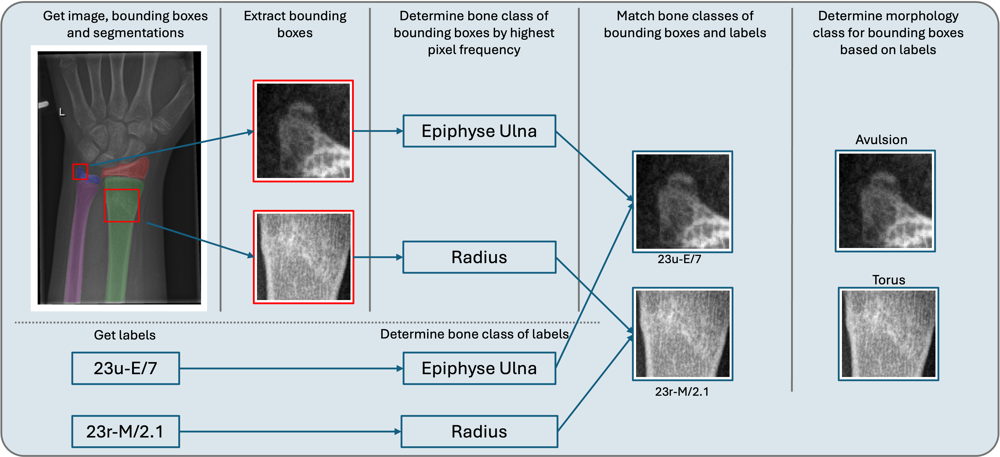

# Fracture Morphology Classification: Local Multiclass Modeling for Multilabel Complexity


## Overview
In this work, we analyse the classification of fracture morphology of paediatric wrist fractures within the AO/OTA system. Therefore, we propose a method to extract fracture morphology by assigning global AO codes to corresponding fracture bounding boxes. This enables a local multi-class classification of single fracture bounding boxes.  



## Environment
Our code is implemented in PyTorch using the PyTorch Lightning framework.
Please use the provided requirements file (requirements.txt) file to create the environment.

```bash
python3 -m venv venv
source venv/bin/activate
pip install -r requirements.txt
```

### Data
Please download the dataset using the provided link in the original [paper](https://www.nature.com/articles/s41597-022-01328-z) and preprocess it with their provided notebooks to obtain the 8-bit images and store them in the `data/preprocessed_images` folder.
Place the metadata file in the `dataset.csv` file in the `data` folder.
Place the given ground truth bounding boxes in `GRAZPEDWRI-DX/folder_structure/yolov5/labels` in the `data/gt_bboxes` folder.

For the generation of the AO code mapping to their bounding boxes, bone segmentation masks are needed. Please download them using the provided link in the original [paper](https://link.springer.com/article/10.1007/s11548-024-03315-8) and store them in `data/raw_segmentations_all.h5`. The Yolo generated bounding boxes are already given in `data/yolo_bbox`.

For running the models, the extraction of the assignment of the global AO codes to the corresponding fracture bounding boxes must be performed by running 

```bash
python preprocessing/add_ao_codes_to_labels.py
```

Therefore, the paths at the beginning of the script must be adapted. If the ground truth labels should be generated, set the output_path to `data/gt_bboxes_labels` and the bool `yolo=False`. For the yolo bounding boxes set the output_path to `data/yolo_bbox_labels` and the bool `yolo=True`.


## Training
To train the different the different models, you can run the different approaches presented in the paper in `experiments` just by if necessary adapting the paths on the top of the scripts and then just run the files by :
```bash
python filename.py
```
Following models are given:

- binary_fracture_classification.py : Binary fracture classification trained on the Yolo bounding boxes
- multilabel_on_full_image.py: Multi-label classification on the full-image on the ground truth AO codes
- multiclass_on_gt_bbox.py: Multi-class classification on the ground truth bounding boxes
- yolo_bbox_classification.py: Multi-class classification on the Yolo bounding boxes
- yolo_bbox_fp_reduction_classification.py: Multi-class classification on the Yolo bounding boxes with the additional Healthy class generated by false-positive reduction.


## Evaluation
The evaluation of the models is already done in the training scripts, so just check out the generated results directory. In `plotting_results` there are two notebooks given for generating a bar plot of the different models showing their F1-Scores and one plot showing the influence of the confidence score for the Yolo approaches.